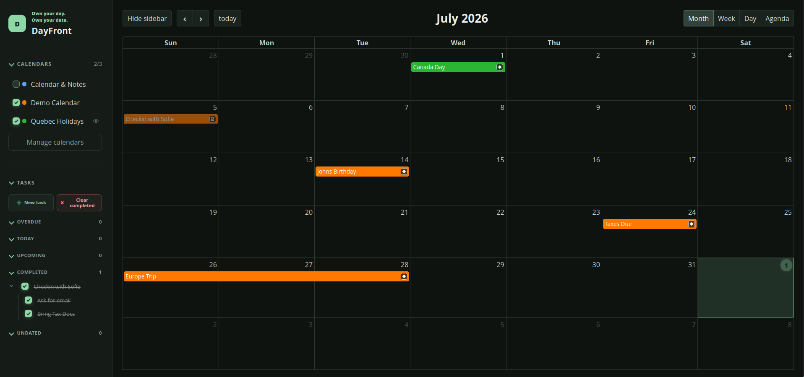

# DayFront

**The open-source CalDAV frontend.**

_Own your day. Own your data._



DayFront is a modern, self-hosted web interface for calendars and tasks stored on an existing CalDAV server.

DayFront uses standard CalDAV and WebDAV discovery rather than Radicale-specific APIs. Radicale is the bundled development and integration-test server; other standards-compliant CalDAV servers can be used through the same `caldav` configuration.

> **Status:** Pre-release. The core calendar and task workflows are functional, but the project is undergoing V1 testing, documentation, security scanning, and deployment validation.

## Features

- Month, week, day, and agenda calendar views
- Multiple CalDAV calendars with visibility controls and colors
- Create, edit, and safely delete CalDAV calendars
- Toggleable, read-only external iCalendar (`.ics`) subscriptions
- Timed, all-day, multi-day, and recurring events
- Series and single-occurrence recurrence editing
- Dated and undated CalDAV tasks
- Recurring tasks, subtasks, priorities, and completion workflows
- Light and dark themes
- Docker, Compose, and Unraid deployment support

CalDAV implementations vary in optional features and edge-case behavior. Radicale is covered by the integration suite; reports and compatibility fixes for other servers are welcome.

## Security boundary

DayFront stores CalDAV credentials only on its backend. It does not currently provide its own user authentication. Keep it on a trusted network or place it behind an authenticating HTTPS reverse proxy before exposing it externally. See [the security guide](docs/security.md).

## Local development

Requirements:

- Node.js 24 or newer
- pnpm 10.14.0
- An accessible CalDAV server

```sh
pnpm install --frozen-lockfile
cp config.example.yaml config.yaml
pnpm dev
```

Edit `config.yaml` with the CalDAV URL and credentials. The web application is available at `http://localhost:5173` during development.

Run the complete local verification suite with:

```sh
pnpm verify
```

## Container deployment

Copy `config.example.yaml` to `config.yaml`, configure the CalDAV connection, then run:

```sh
docker compose up -d --build dayfront
```

See [the deployment guide](docs/deployment.md) for Docker, Compose, Unraid, timezone, health-check, and reverse-proxy configuration.

## License

DayFront is available under the [MIT License](LICENSE).
