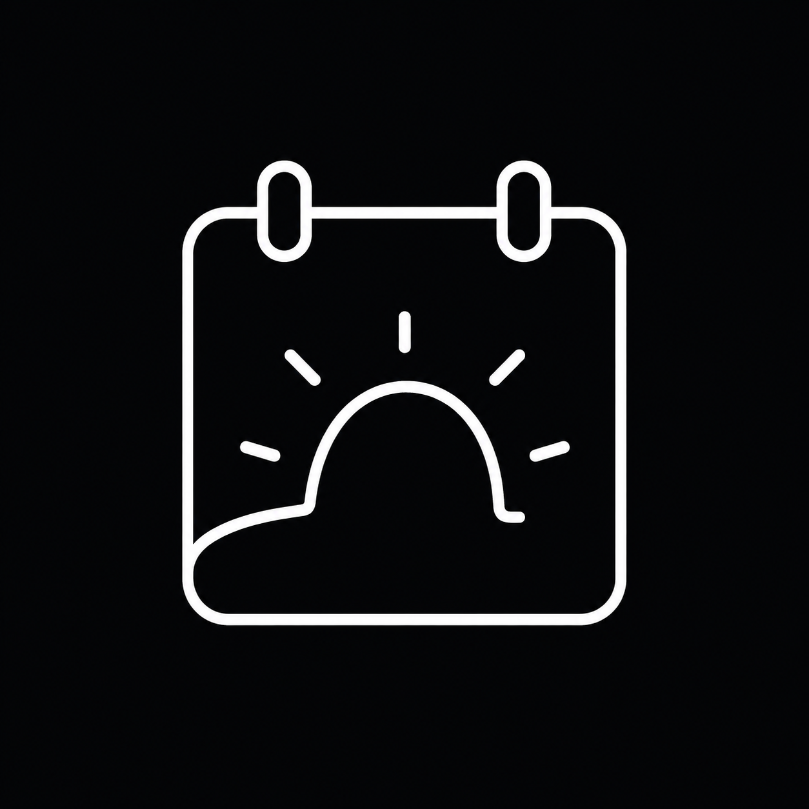

<p align="center">
  <picture>
    <source media="(prefers-color-scheme: dark)" srcset="apps/web/public/dayfront-logo.png" />
    
  </picture>
</p>

# DayFront

**The open-source CalDAV frontend.**

_Own your day. Own your data._

<p align="center">
  <a href="https://buymeacoffee.com/maplepotion">
    
  </a>
</p>

<p align="center">
  <picture>
    <source media="(prefers-color-scheme: dark)" srcset="docs/images/Dark%20Theme/Calendar-Main.png" />
    <source media="(prefers-color-scheme: light)" srcset="docs/images/Light%20Theme/Calendar-Main.png" />
    
  </picture>
</p>

DayFront is a modern, self-hosted web interface for calendars and tasks stored on an existing CalDAV server.

DayFront uses standard CalDAV and WebDAV discovery and connects to standards-compliant CalDAV servers through the `caldav` configuration.

> **Status:** DayFront 1.0 is stable and ready for self-hosted deployment. Compatibility reports for different CalDAV servers are welcome.

## Features

- Month, week, day, and agenda calendar views
- Multiple CalDAV calendars with visibility controls and colors
- Create, edit, and safely delete CalDAV calendars
- Toggleable, read-only external iCalendar (`.ics`) subscriptions
- Timed, all-day, multi-day, and recurring events
- Series and single-occurrence recurrence editing
- Dated and undated CalDAV tasks
- Recurring tasks, subtasks, priorities, and completion workflows
- Light and dark themes
- Docker, Compose, and Unraid deployment support

CalDAV implementations vary in optional features and edge-case behavior. Compatibility reports and fixes for different servers are welcome.

## Screenshots

### Light theme

<table>
  <thead>
    <tr>
      <th>Calendar</th>
      <th>Calendar and tasks</th>
      <th>Login</th>
    </tr>
  </thead>
  <tbody>
    <tr>
      <td>
        
      </td>
      <td>
        
      </td>
      <td>
        
      </td>
    </tr>
  </tbody>
</table>

### Dark theme

<table>
  <thead>
    <tr>
      <th>Calendar</th>
      <th>Calendar and tasks</th>
      <th>Login</th>
    </tr>
  </thead>
  <tbody>
    <tr>
      <td>
        
      </td>
      <td>
        
      </td>
      <td>
        
      </td>
    </tr>
  </tbody>
</table>

## Security boundary

DayFront can use one administrator-configured CalDAV account (`single-user`, the default) or prompt each visitor to sign in with their own CalDAV credentials (`caldav-login`). Login sessions are encrypted, persistent, and inaccessible to frontend JavaScript. Use HTTPS before exposing either mode externally. See [the security guide](docs/security.md).

## Local development

Requirements:

- Node.js 24 or newer
- pnpm 10.14.0
- An accessible CalDAV server

```sh
pnpm install --frozen-lockfile
cp config.example.yaml config.yaml
pnpm dev
```

Edit `config.yaml` with the CalDAV URL and credentials. The web application is available at `http://localhost:5173` during development.

Run the complete local verification suite with:

```sh
pnpm verify
```

## Container deployment

The stable image is available for AMD64 and ARM64 hosts:

```sh
docker pull ghcr.io/erik-a-smith/dayfront:latest
```

Alternatively, copy `config.example.yaml` to `config.yaml`, configure the CalDAV connection, and build locally:

```sh
docker compose up -d --build dayfront
```

See [the deployment guide](docs/deployment.md) for Docker, Compose, Unraid, timezone, health-check, and reverse-proxy configuration.

## License

DayFront is available under the [MIT License](LICENSE).
